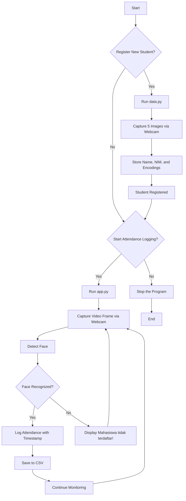

# Face Recognition Attendance System

This project is a face recognition-based attendance system that captures student details, stores their face encodings, and records their attendance based on facial recognition.

## Features

- **Face Registration**: Add new students with their name and student ID (Nomor Induk Mahasiswa - NIM).
- **Real-time Face Recognition**: Recognize faces in real-time using a webcam or IP camera.
- **Attendance Logging**: Automatically logs the attendance of recognized students into a CSV file with a timestamp.
- **CSV Export**: Attendance records are stored in a CSV file, which can be easily accessed and processed.

## Requirements

- Python 3.7 or higher
- Required Libraries:
  - `face_recognition`
  - `opencv-python`
  - `numpy`
  - `pandas`
  - `pickle`

Install the required libraries using pip:

```bash
pip install face_recognition opencv-python numpy pandas
```

Alternatively, you can install all dependencies using the provided `requirements.txt` file:

```bash
pip install -r requirements.txt
```

## Setup

1. **Clone the repository:**

    ```bash
    git clone https://github.com/fiqgant/WBI-Attendance.git
    cd WBI-Attendance
    ```

2. **Register New Students:**

    Use the `data.py` script to register new students. The script will capture 5 images from the webcam and store their facial encodings.

    ```bash
    python data.py
    ```

    Follow the prompts to enter the student's name and NIM.

3. **Start Face Recognition:**

    Run the `app.py` script to start real-time face recognition and attendance logging.

    ```bash
    python app.py
    ```

    Press `q` to quit the program.

## Flowchart



## How It Works

1. **Student Registration (`data.py`):**
   - Captures the student's face using a webcam.
   - Stores the student's name and NIM in a pickle file (`details.pkl`).
   - Stores the student's face encodings in a pickle file (`embed_details.pkl`).

2. **Face Recognition (`app.py`):**
   - Loads the student details and face encodings.
   - Captures video from a webcam or IP camera.
   - Resizes each frame to improve processing speed.
   - Detects and recognizes faces in each frame.
   - Logs the recognized student's attendance with a timestamp in a CSV file named with the current date.
   - If a face is unrecognized, it displays "Mahasiswa tidak terdaftar!" (Student not registered).

## CSV Output

Attendance is logged in a CSV file named with the current date (e.g., `2024-08-23.csv`). The CSV contains the following columns:

- **Nama&NIM**: Student's name and NIM.
- **Time**: Time of attendance.

## Usage Instructions

1. **Register Students:**
   - Run `data.py` and follow the on-screen instructions.
   - Capture 5 images of the student using the webcam (press "s" on keyboard).

2. **Start Attendance Logging:**
   - Run `app.py` to start the face recognition and attendance logging.
   - Ensure the webcam is properly connected and positioned for optimal face detection.

3. **View Attendance Records:**
   - Open the CSV file generated for the day to view the logged attendance.
